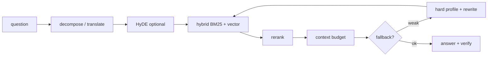

# ZT-RAG: parhaat hakukäytännöt (tarkkuus)

Ohje **agenteille** ja **ylläpidolle**, kun käytät MCP-työkaluja `zt_query`, `zt_status` ja ingest-polkuja. Ympäristömuuttujien täydellinen lista: [PERF_ENV.md](PERF_ENV.md). Agentin lyhyt muistio: [MCP_AGENT_OHJE.md](MCP_AGENT_OHJE.md).

## 1. Ennen hakua: tiedä mitä indeksissä on

Sinulla **ei ole oletuksena** korpustietoa (kirjojen nimet, luvut). Tee aina:

1. **`zt_status`** — onko indeksi julkaistu? `published_meta.sources` → mitkä tiedostopolut on indeksoitu.
2. **`zt_verify_coverage`** — manifest vs. julkaistu indeksi (puuttuva ingest = heikko recall).
3. **`zt_list_ingestible`** — mitä levyllä on vs. mitä indeksissä (ennen sync/ingest).

Työtilassa `datapankki-mcp` voit lukea raakatekstiä `Databank/<pankki>/` (Read/Grep), jos käyttäjän koneella on sisältö.

**Ingest-parannusten jälkeen:** jos vastaukset ovat vanhan indeksin mukaan, varmista että ylläpito on ajanut **`zt_ingest` + `force_rebuild`** — ks. [INGEST_EPUB.md](INGEST_EPUB.md).

## 2. Kysymyksen muotoilu (suurin vaikutus ilman konfiguraatiota)

- Käytä **selkeitä teknisiä termejä** ja **oikeita nimiä** (komennot, protokollat, työkalut), jotka todennäköisesti esiintyvät dokumentaatiossa.
- Abstrakti kysymys → **pilko useaksi konkreettiseksi** alakysymykseksi tai toista **eri sanoin** (suomi/englanti, synonyymit).
- Jos vastaus on “ei löydy lähteistä” tai **sitaattivahvistus epäonnistuu**, kysymys on usein **väärällä sanastolla** suhteessa indeksiin — muotoile lähemmäs `zt_status`-poluista tai käyttäjän kuvaamaa aihetta (esim. vim → `:wq`, Ansible → *playbook*).

Esimerkkejä:

| Heikko | Parempi |
|--------|---------|
| “Miten paketit asennetaan?” | “dnf install package name Fedora” |
| “Turvallisuus” | “firewalld rich rules permanent zone” |
| “AI training” | “fine-tuning large language models supervised” |

## 3. Mitä tapahtuu taustalla (`zt_query`)

Lyhyt putki (yksityiskohdat koodissa: `cli_runner.run_query`, `query_rewrite.py`, `retrieval.py`):

- **Dekomponointi** parantaa recallia monitopic-kysymyksissä; `ZT_QUERY_POLICY=fast` tai `ZT_SKIP_QUERY_DECOMPOSE=1` **heikentää** tarkkuutta (nopeus).
- **HyDE** (`ZT_ENABLE_HYDE=1`) auttaa abstrakteja kysymyksiä.
- **Fallback** (`ZT_ENABLE_QUERY_FALLBACK=1`) tekee toisen haun leveämmällä profiililla, jos konteksti on tyhjä tai kapea.

Telemetriasta (`zt_query`-vastaus): `retrieval_chosen_attempt`, `fallback_trigger_reason`, `rerank.events`, `context_build`.

## 4. Milloin agentti muotoilee uudelleen vs. milloin ylläpito säätää

| Tilanne | Toimi |
|---------|--------|
| Ensimmäinen haku heikko, termit epätodennäköisiä | Muotoile kysymys uudelleen (konkreettiset komennot/nimet). |
| Useat uudelleenmuotoilut eivät auta, indeksi ok | Kerro käyttäjälle: **ylläpidon** säätö (`PERF_ENV`, hard-profiili, fallback). |
| `zt_verify_coverage` epäonnistuu / puuttuvia lähteitä | Ingest/sync, ei pelkkä kysymyksen hienosäätö. |
| EPUB-ingest juuri päivitetty, indeksi vanha | `force_rebuild` ingest — ks. [INGEST_EPUB.md](INGEST_EPUB.md). |

## 5. Ylläpidon profiilit (löydettävyys)

### Hard-profiili (leveämpi haku)

- MCP/kehitys: `python -m devworkflow.zt_rag.mcp_query_batch --hard`
- Asettaa mm. `ZT_ENABLE_HYDE=1`, suuremmat `ZT_TOP_K_FUSION` / `ZT_MULTI_QUERY_*`, `ZT_CONTEXT_CHUNKS=14` — arvot: [`query_hard_profile.py`](../devworkflow/zt_rag/query_hard_profile.py).

### Query-fallback + termihakemisto

| Muuttuja | Käyttö |
|----------|--------|
| `ZT_ENABLE_QUERY_FALLBACK=1` | Toinen hakuyritys heikon ensimmäisen jälkeen |
| `ZT_ENABLE_CORPUS_AWARE_REWRITE=1` | Fallback-kyselyt käyttävät `term_catalog.jsonl` |
| `ZT_DISABLE_TERM_CATALOG=1` | Älä rakenna termihakemistoa ingestissä |

Fallback laukeaa mm. kun kontekstirivejä &lt; `ZT_FALLBACK_MIN_CTX_ROWS` tai pooli &lt; `ZT_FALLBACK_MIN_PRE_RERANK_POOL` (ks. [PERF_ENV.md](PERF_ENV.md)).

## 6. Kontekstibudjetti: miksi hyvät osumat “katoavat”

Haettu chunk ei välttämättä päädy LLM:lle:

- `ZT_CONTEXT_MAX_CHARS` (oletus 45000)
- `ZT_CONTEXT_MAX_CHUNK_CHARS` (6000 / chunk)
- `ZT_CONTEXT_MAX_ROWS`
- Deduplikointi identtisestä tekstistä

Nosta budjettia tai `ZT_CONTEXT_CHUNKS` vain jos latenssi ja kustannus ok — ks. PERF_ENV.

Chunkit näytetään lähteinä muodossa `title`, `section` (otsikkopolku), `lang` (kun ingest on uusi).

## 7. Mittaus ja regressio

- **Golden-setit:** [`devworkflow/zt_rag/golden_sets/README.md`](../devworkflow/zt_rag/golden_sets/README.md) — täytä `gold_chunk_ids` ingestin jälkeen.
- **Eval:** `python -m devworkflow.zt_rag.eval_runner` — `recall@k`, `fallback_chosen_rate`.
- **A/B:** `./devworkflow/zt_rag/run_vocab_ab_compare.sh`
- **Batch:** `./devworkflow/zt_rag/run_query_batch_hard_all.sh` tai `mcp_query_batch --hard`

## 8. Troubleshooting

| Oire | Tarkista |
|------|----------|
| Tyhjä konteksti | Indeksi julkaistu? `zt_status`; kysymyksen sanasto; fallback päällä? |
| Oikea aihe, väärät lainaukset | Kontekstibudjetti; rerank `ZT_RERANK_POLICY` |
| Hidas mutta tarkka tarvitaan | Älä käytä `fast`-polkua; HyDE + hard batch |
| Ingest-GPU MCP | **`zt_query` ei ole käytössä** — kysely varsinaisesta query-MCP:stä |
| Vain englannin korpus, suomen kysymys | Muotoile englanniksi tai käytä käännöstä (decompose-polku) |

## 9. MCP-työkalut (muistio)

| Työkalu | Tarkkuus |
|---------|----------|
| `zt_status` | Mitä on indeksissä |
| `zt_query` | Päähaku + telemetria |
| `zt_verify_coverage` | Puuttuva sisältö |
| `zt_sync_sources` / `zt_ingest` | Uusi tai päivitetty korpus |

---

*Päivitä tätä, jos `zt_query`-telemetria tai ingest-metakentät muuttuvat.*
